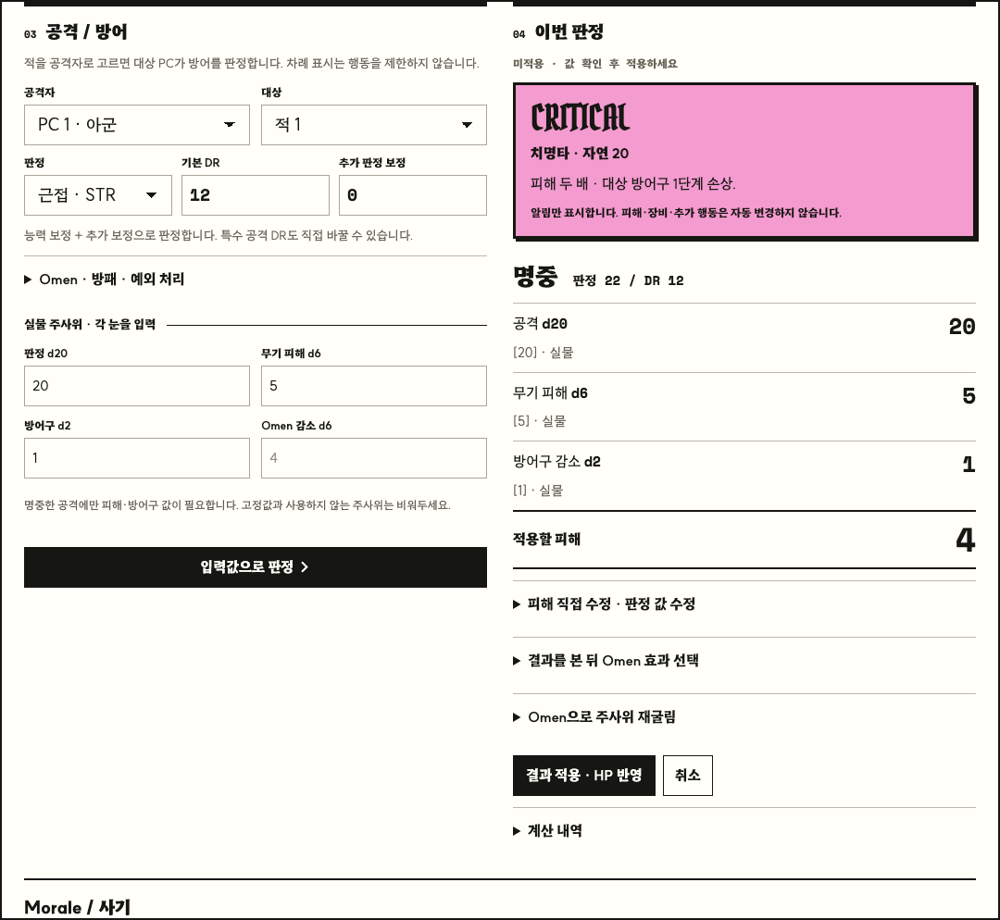
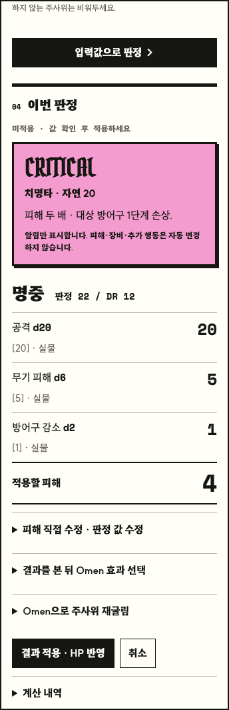

# 전투 도구

오른쪽 아래 **전투**를 누르면 언제든 엽니다. 몬스터와 주요 전투 규칙의 참조 창에서도 열 수 있습니다. 캐릭터를 불러오지 않고 아군·적을 추가해 전투에 필요한 값만 입력합니다.

## 사용

1. 아군·적의 HP, 능력 보정, Morale, Omen, 무기 피해와 방어구 감소를 입력합니다. 상태 메모는 자유 입력입니다. 무기·방어구에는 `d6`, `2d4+1`, 고정값 `3` 등을 사용할 수 있습니다.
2. **앱 주사위** 또는 **실물 값 입력**을 고르고 선공을 정합니다. 라운드의 선공·후공은 안내용이므로 반격이나 예외 행동을 막지 않습니다.
3. 공격자·대상과 DR을 정해 판정합니다. 아군의 근접은 STR, 원거리는 PRE, 적의 공격은 대상 아군의 AGI 방어 판정을 사용합니다.
4. **미적용 결과**를 확인하고 필요하면 최종 피해를 직접 수정합니다. **결과 적용 · HP 반영**을 눌러야 HP·Omen·명시적으로 선택한 방패 희생이 반영됩니다.
5. **후공으로**, **다음 라운드**를 사용합니다. **시작점 복원**은 해당 라운드의 선공 또는 후공 시작 당시의 모든 값·장비·메모·참가자를 복원합니다. 한 작업 되돌리기와 다시 적용도 가능합니다.

**CRITICAL / FUMBLE은 알림입니다.** 자연 20·1과 해당 규칙을 크게 표시하지만 치명타 배수, 방어구 손상, 무기 파손·분실, 추가 공격을 자동 적용하지 않습니다. 기본 판정과 기본 피해를 제시하고 사용자가 필요한 예외를 직접 수정합니다.

Omen은 판정 전 선택, 결과를 본 뒤 기존 눈을 유지한 효과 선택, 특정 주사위 재굴림을 지원합니다. 선택 효과 한 가지와 재굴림 비용을 결과 적용 시 소비합니다. 효과를 변경하면 직접 지정한 최종 피해를 다시 계산합니다. 실물 주사위는 각 눈을 입력하며, 빠진 값 대신 임의로 굴리지 않습니다.

사기 판정은 사용자가 필요할 때 실행합니다. `2d6 > Morale`이면 별도 `d6`으로 도주/항복을 정하고 상태 메모와 참여 여부에 반영합니다. 이 처리도 되돌릴 수 있습니다. HP 0의 PC에는 기존 Broken 참조를 제공합니다.

## 저장 범위와 구조

- 현재 탭의 전투만 `sessionStorage`의 `morkborg-combat-tool:v1`에 보관합니다. 새로고침과 도구 패널 닫기/다시 열기 사이에 유지됩니다. 탭을 닫은 이후의 캠페인 저장은 제공하지 않습니다.
- `CombatSession`은 불변 `CombatFrame` 스냅샷과 현재 위치를 갖습니다. 되돌린 뒤 새 작업을 하면 그 이후의 기록은 새 흐름으로 대체됩니다.
- 판정 미리보기는 상태를 변경하지 않습니다. 참가자 값이 바뀌면 이전 미리보기의 적용을 거부합니다.
- 손상된 저장 자료는 자동으로 덮어쓰지 않습니다. 저장 공간 부족 시 현재 창의 메모리와 되돌리기는 유지하고 경고합니다.
- 기존 캐릭터·NPC·던전·도시 저장, 정식 표, 참조 연결, 검색·핀·최근·Workbench 데이터는 변경하지 않습니다. 기존 `rollDie` 난수 함수를 사용하며 규칙 링크는 기존 Reference Desk로 이동합니다.

## 검증

- 기준 커밋: `f9a7c82516f10061725cc3f5e7d003cad764a448`.
- 기준 전체 테스트: **1099 통과**, 실패·건너뜀 0.
- 최종 전체 테스트: **1122 통과**, 실패·건너뜀 0. 기준보다 전투 테스트 23개가 추가되었습니다.
- 전투 도메인: **23 통과**, 실패·건너뜀 0. 자연 20·1 네 경우의 수동 효과, 실제 주사위 입력, Omen 비용·재굴림·결과 후 적용, 장비 변경, 사기, 스냅샷 복원, 손상 자료 검증을 포함합니다.
- 브라우저: **360 / 768 / 1440 / 3440px 통과**. 앱·실물 입력, 결과 적용 전 HP 유지, CRITICAL/FUMBLE, 피해 수정, 결과 후 Omen 무효화, Omen 재굴림, 선공 시작점 복원, Undo/Redo, 새로고침, 사기, Escape·포커스 복원·브라우저 뒤로가기를 실제 화면에서 검증했습니다.
- 모바일은 터치 진입, 입력, 가로 넘침 없음을 확인했습니다. 주 조작은 최소 44px이며 체크박스는 44px 이상의 연결된 라벨로 조작합니다. 알림은 live region을 사용합니다. 별도 스크린리더의 음성 출력 검증은 하지 않았습니다.
- 기존 Morale 참조 → 전투 도구, 4명의 독립적인 참가자, 공격자·대상 선택, 기존 치명타 규칙 reader → 전투 도구 복귀도 검증했습니다.
- 데이터 무결성: 정식 데이터 해시 변화 없음. 아카이브 표 546 / 절차 60 / 참조 993, 배포 표 545 / 절차 60 / 참조 987로 전후 동일합니다.
- 브라우저 검증 중 발견한 ‘롤백 후 입력칸에 이전 편집 초안이 다시 나타남’을 수정하고 재검증했습니다.
- TypeScript 클라이언트·서버 검사, Vite 빌드, 공개 빌드 및 private boundary 검사, lint 통과. 기존 번들 크기 경고는 남아 있습니다.

작업 중 원래 Desktop 폴더의 iCloud 파일 내려받기가 멈추어, 동일 기준 커밋과 작업 내용 및 동일한 로컬 원본 자료를 iCloud 밖의 임시 폴더로 복구해 검증했습니다. 원본 자료와 비공개 데이터는 커밋에 포함하지 않습니다.

재현: `npm test`, `npm run lint`, `npm run build`. 브라우저 검증은 개발 서버를 실행한 뒤 `REFERENCE_URL=http://127.0.0.1:5173 PLAYWRIGHT_MODULE=<playwright/index.mjs> node scripts/check-combat-browser.mjs`를 실행합니다.
