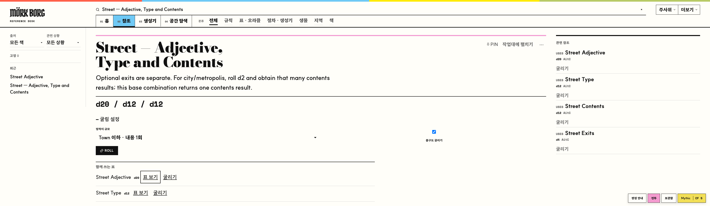

# Reference Action Proximity Calibration

Baseline commit: `df60d4399af231aa978d9e7769ae5625ebc5152b`

2026-09-27. 기존 참조를 찾은 **이후**의 접근 비용만 측정했다. 33개 실제 Reference × 4개 viewport = 132개 동일 행동을 전후 비교했다. 일반 Reference Desk의 Related 왕복에서 발생하던 포커스 손실과 기존 절차 행의 크기·간격만 수정했다. 새 추천·관계·도구·workflow는 추가하지 않았다.

## 1. Baseline

- 전체 테스트: **1,192 pass / 0 fail / 0 skip**.
- `npm run build`: 통과. 기존 500 kB chunk 경고 유지. 공개 빌드/비공개 데이터 경계 검사 통과(52개 정적 파일).
- `npm run lint`: 통과.
- 동일 커밋의 `/tmp/mork-dungeon-access` checkout에서 검증했다. 초기 앱 소스 수정 전에 테스트·빌드·린트와 production preview 감사를 완료했다.

## 2. Reference corpus

Oracle 15개(그중 참조 전용 3개), Rule 6개, Procedure 5개, Creature 3개, Region 2개, Book 2개. 출처 ID는 9개: core, core-full, feretory, heretic, reclvse, sd, depths, aitc, mythic2. 모든 ID·대상은 현재 레지스트리에서 available임을 확인했다. 전체 선정 근거와 canonical IDs는 [corpus.json](corpus.json)에 있다.

| # | 실제 Reference ID | 선정 이유 |
|---:|---|---|
| 1 | `oracle:core.weather` | 짧은 독립 표·관계 적음 |
| 2 | `oracle:core.reaction` | 짧은 전투 표·재굴림 |
| 3 | `oracle:feretory.campsite` | 여정 결과의 SUBTABLE |
| 4 | `oracle:aitc.taverns` | 도시 결과의 FOLLOW-UP |
| 5 | `oracle:aitc.civic-buildings` | 고정 LOOKUP |
| 6 | `oracle:reclvse.quickContents` | 10A–D 연결의 SUBTABLE |
| 7 | `oracle:mythic2.meaning.action-1` | Mythic 긴 짝 표 |
| 8 | `oracle:mythic2.random-event-focus-table` | Mythic 사건 표 |
| 9 | `oracle:heretic.curses` | Heretic 긴 결과 표 |
| 10 | `oracle:core.weaponCatalog` | 참조 전용·읽기 |
| 11 | `oracle:aitc.merchant-disposition` | 참조 전용·긴 표의 자연스러운 읽기 비용 |
| 12 | `oracle:feretory.travelDistances` | 참조 전용 여정 거리 |
| 13 | `rule:core.rest` | 조건 요약과 접힌 원문 |
| 14 | `rule:core.reaction-morale` | 전투 규칙의 RELATED |
| 15 | `rule:mythic.npc-behavior` | Mythic 규칙과 기존 절차 관계 |
| 16 | `rule:feretory.roads` | 여정 규칙·긴 본문 |
| 17 | `rule:sd.stockCommon` | 최근 보정된 역방향 접근 |
| 18 | `rule:sd.dungeonCrawling` | 던전 기존 행동 |
| 19 | `procedure:aitc.street` | 도시 절차 USES |
| 20 | `procedure:character.core-classless` | 캐릭터 복합 절차 |
| 21 | `procedure:workbench.npc` | 긴 조합 결과의 재굴림 |
| 22 | `oracle:feretory.A` | 몬스터 생성 결과와 재굴림 |
| 23 | `procedure:mythic2.action-pair` | Mythic 절차의 USES |
| 24 | `creature:core:61:nodh` | 정확한 생물 전투 추가 |
| 25 | `creature:core:58:seth` | 생물 RELATED와 왕복 |
| 26 | `creature:feretory:feretory.epk.antideer` | 다른 책 생물·참조 읽기 |
| 27 | `region:sarkash` | 지역의 기존 몬스터 참조 |
| 28 | `region:kergus` | 지역 기존 Quick Tool |
| 29 | `book:core` | 책 탐색 허브 |
| 30 | `book:mythic2` | 다른 책의 탐색 허브 |
| 31 | `oracle:core.gearA` | 긴 짝 표의 USED BY |
| 32 | `procedure:workbench.stock-room` | 결과의 정확한 생물 SOURCE |
| 33 | `oracle:core.treasures` | 오라클 결과 SOURCE disclosure와 책 왕복 |

## 3. Intended actions

아래 행동과 대상, 결과 준비용 RNG는 브라우저 진입 전에 [corpus 설정](../../scripts/reference-proximity-corpus.json)에 고정했다. 결과가 필요한 fixture는 실제 ROLL을 누른 다음 다른 참조를 검색하고 원래 참조를 다시 검색해 기존 결과를 열었다. 결과나 navigation state를 storage로 주입하지 않았다. 검색 비용은 이 pass의 측정 범위 밖이다.

| # | 미리 정한 행동 | 정확한 이동 대상 |
|---:|---|---|
| 1 | 명시적으로 날씨 ROLL | 현재 참조에서 완료 |
| 2 | 이미 나온 반응 REROLL | 현재 참조에서 완료 |
| 3 | 야영 꿈 하위 표 열기 | `oracle:feretory.campsite.campDream` |
| 4 | 주인의 Merchant Dispositions 열기 | `oracle:aitc.merchant-disposition` |
| 5 | 2번 건물 결과의 NPC 54 조회 열기 | `oracle:aitc.npc-encounters` |
| 6 | Discovery 하위 표 열기 | `oracle:reclvse.roomDiscovery` |
| 7 | Action 의미 굴리기 | 현재 참조에서 완료 |
| 8 | 사건 초점 명시적 ROLL | 현재 참조에서 완료 |
| 9 | 저주 명시적 ROLL | 현재 참조에서 완료 |
| 10 | 무기 표 첫 항목 읽기 | 현재 참조에서 완료 |
| 11 | 상인 태도 표 마지막 항목 읽기 | 현재 참조에서 완료 |
| 12 | 여행 거리 첫 항목 읽기 | 현재 참조에서 완료 |
| 13 | 전체 휴식 규칙 원문 읽기 | 현재 참조에서 완료 |
| 14 | Failed Morale 표 열기 | `oracle:core.failedMorale` |
| 15 | Action 의미 절차 열기 | `procedure:mythic2.action-pair` |
| 16 | 관련 Campsite 열기 | `oracle:feretory.campsite` |
| 17 | Encounter Prep 열기 | `procedure:workbench.stock-room` |
| 18 | 명시적으로 던전 탐색 판정 | 현재 참조에서 완료 |
| 19 | 독립 구성 표 Street Adjective 열기 | `oracle:aitc.street-adjective` |
| 20 | 명시적으로 캐릭터 생성 | 현재 참조에서 완료 |
| 21 | 현재 NPC 전체 REROLL | 현재 참조에서 완료 |
| 22 | 현재 몬스터 REROLL | 현재 참조에서 완료 |
| 23 | 독립 구성 표 Action 1 열기 | `oracle:mythic2.meaning.action-1` |
| 24 | Nodh를 전투에 적으로 추가 | 현재 참조에서 완료 |
| 25 | 관련 Corpse Plundering 열기 | `oracle:core.corpsePlundering` |
| 26 | Antideer 특성 읽기 | 현재 참조에서 완료 |
| 27 | Sarkash 지역 몬스터 열기 | `rule:regional-monsters:sarkash` |
| 28 | 지역을 유지하며 NPC 도구 열기 | `procedure:workbench.npc` |
| 29 | 기존 Names 참조 열기 | `oracle:core.names` |
| 30 | 기존 Action 참조 열기 | `oracle:mythic2.meaning.action-1` |
| 31 | 이 표를 쓰는 캐릭터 생성 절차 열기 | `procedure:character.core-classless` |
| 32 | 생성된 Nodh 원문 열기 | `creature:core:61:nodh` |
| 33 | 보물 결과 출처의 원서 참조 열기 | `book:core` |

관계 포함: SOURCE #32·33, RELATED #15–17·25·29–30, FOLLOW-UP #4, SUBTABLE #3·6, LOOKUP #5, USES #19·23, USED BY #31. #14는 기존 본문 관계에 같은 정확한 대상이 이미 있어 Related에서 중복 제거된 경우이며 그 기존 진입점을 사용했다.

## 4. Before audit

실제 Chromium에서 production build를 `vite preview`로 서비스했다(`127.0.0.1:5178`). 로컬 비공개 bundle의 API 응답만 연결했고 앱의 정상 자료 로딩을 거쳤다. UI Search → 참조 선택 → 휠/탭/클릭/키보드 → browser Back을 실행했다. DOM 좌표만 비교한 감사가 아니다.

- 원시 측정: [before-audit.json](before-audit.json), [after-audit.json](after-audit.json). 각 항목에 viewport, ID, kind, intent, 최초 geometry/visibility, 클릭·탭·키보드·휠 횟수, scroll events/px/VH, disclosure, Back, 다른 참조 이동, 복귀 scroll/focus/details/reading을 기록했다.
- First Action Distance = 목표 상단의 document Y − 참조가 열린 최초 viewport의 scroll Y(최소 0). px와 VH를 기록한다. V3는 disclosure를 펼친 뒤 목표 위치를 같은 최초 기준점에 대해 측정하며 별도 표기했다.
- read-only 행동은 첫/마지막 표 행이나 지정한 규칙 본문이 목표다. 이 경우 버튼 활성화는 없다.
- V0는 최초 viewport 안, V1은 목표 하단까지 추가 이동이 1 VH 미만, V2는 1 VH 이상, V3는 disclosure가 필요한 경우다. V4는 불필요한 별도 navigation이다. 미리 의도한 관계 이동 자체를 V4로 세지 않았다.
- `actionScroll`은 행동에 도달하기 위한 이동이며 Search·fixture 준비·Back을 제외한다. `totalScroll`은 이후 navigation/Back과 native focus 이동까지 포함한다. scroll event 수는 브라우저가 병합하므로 px를 주요 지표로 사용했다.
- 모든 첫 진입과 관계 열기는 RNG 0. ROLL/REROLL을 직접 활성화한 경우에만 RNG 호출을 확인했다.

## 5. Visibility classification

| 분류 | Before | After |
|---|---:|---:|
| V0 | 83 | 83 |
| V1 | 36 | 36 |
| V2 | 5 | 5 |
| V3 | 8 | 8 |
| V4 | 0 | 0 |

V3 8건은 휴식 원문 펼침 4건과 보물 SOURCE 펼침 4건이다. 둘 다 의미가 명시된 기존 disclosure다. V2를 자동으로 결함으로 판정하지 않았다.

## 6. Friction classification

각 viewport-fixture에 한 가지 주원인을 부여했다(E 우선, 다음 F, 자연스러운 장문 비용 A, 그 외 G). 복합 요인은 아래 사례 설명에 적었다. 이 분류는 코드의 행동 추론에 사용되지 않는다.

| 원인 | 건수 | 판단 |
|---|---:|---|
| A CONTENT_LENGTH | 29 | 장문 결과·표·출처에 따른 자연스러운 이동 |
| B INFORMATION_HIERARCHY | 0 | 일괄 재배치가 필요하다는 반복 근거 없음 |
| C DUPLICATION | 0 | 새 중복 action을 만들 이유 없음 |
| D DISCOVERABILITY | 0 | 이번 지정 행동에서 기존 label/disclosure로 도달 가능 |
| E ROUND_TRIP | 28 | 일반 Desk의 Related 7개 fixture × 4 크기에서 focus origin 손실 |
| F RESPONSIVE | 12 | #18·19·23 × 4 크기의 작은 버튼 또는 멀리 떨어진 절차 버튼 |
| G EXPECTED_COST | 63 | 즉시 접근 또는 의미가 분명한 기존 펼침·읽기 비용 |

E 사례는 Mythic NPC Behavior, Roads, Stock Common, Seth, Core 책, Mythic 책, Starting Equipment이다. 이 중 Starting Equipment의 긴 표 뒤 USED BY는 A 비용도 있으나 실제 수정 근거는 E였다. F 중 목표 높이 44px 미만은 10건이며 나머지 2건은 3440에서의 가로 분리다.

## 7. Findings

- **반복된 결함:** 일반 Desk는 Reference 본문만 transient view로 저장했다. Related가 형제 영역이라 눌렀던 버튼의 focus path가 빠졌다. 결과 내 링크와 Spatial reader는 정상인 반면, 같은 Related 종류에서 28회 손실이 재현됐다.
- **반복된 크기 문제:** 절차의 `표 보기`는 360/768에서 약 38.3px, 1440에서 약 39.8px였고, 던전 탐색 판정 버튼은 40px였다.
- **반복된 가로 거리:** Street와 Mythic Action 절차에서 1440의 표 이름–버튼 간격은 약 756/813px, 3440에서는 1,795/1,873px였다. 기존 행의 flex 확장이 빈 공간을 만들었다.
- **가설 A:** 긴 표 뒤 관계에 긴 스크롤은 있었다. 그러나 본문 후 조회에 자연스러운 배치이고, 3440에서는 기존 Related 옆면 배치가 이미 작동했다. 전체 Related 이동 가설은 채택하지 않았다.
- **가설 B:** 최초 ROLL은 가까웠다. NPC 전체 REROLL은 360에서 2,538px 지점에 있었지만 긴 결과를 읽은 다음에 쓰는 현재 위치를 유지했다.
- **가설 C:** 생물 Add to Combat은 최초 화면에서 접근됐다. 버튼을 키우거나 상단에 복제할 근거가 없었다. 생물의 Related 왕복 포커스만 공통 수정 대상이다.
- **가설 D:** 모바일의 장문 비용 증가는 관찰됐지만 전반적인 hierarchy 붕괴나 document overflow는 없었다. 작은 목표 크기를 보정하고 기존 모바일 줄바꿈은 유지했다.
- **가설 E:** 기존 Dungeon/Combat 왕복 개선은 유효했다. 다만 일반 Desk의 형제 Related 영역까지 충분히 포괄한다는 가설은 기각됐다.

## 8. Implemented calibration

- `src/components/ReferenceWorkbench.tsx`: 기존 view capture/restore root가 가장 가까운 `.spatial-reader` 또는 `.desk-current-page`를 포함하도록 변경. 기존 reading identity guard, 20개 transient cache, history system은 그대로다.
- `src/components/reference-surface.css`: 절차 표 버튼과 던전 판정 action에 기존 control-height token을 적용했다. 측정 대상 action은 모두 44px 이상이다.
- `src/publication.css`: 절차 구성 표 영역은 최대 72ch. 801px 이상에서는 표 이름 직후에 기존 버튼이 이어지도록 flex 확장을 제거했다. 모바일의 기존 45% 배치와 줄바꿈은 보존했다. 행 내부 여백을 10px → 8px로 줄여 커진 터치 영역으로 전체 행이 불필요하게 길어지지 않게 했다.

실제 앱 변경은 위 3개 파일, 16줄 추가/4줄 삭제다. 나머지는 측정·검증 스크립트와 이 보고서/증거다.

## 9. Rejected changes

- Related/FOLLOW-UP을 전부 상단으로 이동하거나 action을 복제하지 않았다. #14처럼 기존 정확한 본문 진입점이 이미 있는 경우가 있다.
- sticky Roll/Related, floating toolbar, Quick Actions, 새 sidebar·panel·modal을 추가하지 않았다. 긴 결과의 REROLL을 무조건 상단으로 올리지 않았다.
- Source disclosure의 장문 비용은 원문 표와 출처를 읽는 비용이다. 출처를 단축하거나 source identity를 다른 참조로 우회하지 않았다.
- 본문에서 다음 행동을 추론하거나 prose/title/keyword로 semantic edge를 생성하지 않았다.

## 10. Before / After

132개의 동일 fixture. 1 VH = 1,000px. P90는 nearest-rank다.

| Metric | Before | After |
|---|---:|---:|
| median First Action Distance (px) | 814 | 810 |
| P90 First Action Distance (px) | 1,647 | 1,647 |
| action 접근 scroll (px) | 38,585 | 38,577 |
| 왕복 포함 총 scroll (px) | 97,253 | 97,221 |
| action scroll event | 91 | 91 |
| 왕복 포함 scroll event | 171 | 171 |
| click | 81 | 81 |
| tap | 30 | 30 |
| keyboard activation | 9 | 9 |
| extra disclosure opens | 8 | 8 |
| browser Back | 72 | 72 |
| lost focus | 28 | 0 |
| lost scroll | 0 | 0 |

세로 거리 중앙값 변화는 4px뿐이다. 이를 전반적인 탐색 속도 개선이라고 주장하지 않는다. 실제 개선은 **포커스 복구, 유효 터치 영역, 같은 행의 가로 간격**이다. 표 이름–버튼 간격은 1440/3440의 두 절차 모두 **12px**가 됐다.

| kind (측정 건수) | median px 전→후 | P90 px 전→후 | 접근 scroll px 전→후 | focus 손실 전→후 |
|---|---:|---:|---:|---:|
| oracle (60) | 792 → 792 | 2309 → 2309 | 21,878 → 21,878 | 4 → 0 |
| rule (24) | 994 → 993.5 | 1498 → 1492 | 7,426 → 7,415 | 12 → 0 |
| procedure (20) | 869 → 867 | 1772 → 1772 | 6,719 → 6,722 | 0 → 0 |
| creature (12) | 464 → 464 | 1458 → 1458 | 2,562 → 2,562 | 4 → 0 |
| region (8) | 470.5 → 470.5 | 760 → 760 | 0 → 0 | 0 → 0 |
| book (8) | 784 → 784 | 882 → 882 | 0 → 0 | 8 → 0 |

극단값: Starting Equipment → USED BY는 360에서 4,583px, 보물 SOURCE는 4,206px. 기존 표를 펼쳐 읽는 비용을 그대로 두었다. 네 크기별 전체 분포와 fixture별 차이는 [summary.json](summary.json)에 있다.

## 11. Regression budget

- 상호작용 개선 **40/132건**: 포커스 28건, 나머지 12건은 터치 크기/가로 간격.
- 세로 목표 위치 또는 접근 scroll 수치가 소폭 증가한 **4/132건**. 최대 목표 위치 증가 **1px**, 최대 접근 scroll 증가 **4px**. 개선 건수와 중복될 수 있다.
- 세부: 360 Dungeon Crawl scroll +4px, 360 Street scroll +3px(목표 상단은 −2px), 1440 Roads 목표/scroll +1px, 1440 Stock Common 목표 +1px.
- 신규 V3/V4 **0**, 가시성 등급 악화 **0**, document overflow **0**. 본문·결과 순서, ROLL과 읽기 구분, 이미 있던 action 수를 변경하지 않았다.

## 12. Round-trip

메인 corpus의 의도한 관계 왕복 **72건** 전부 동일 reading·details·scroll 복원. focus는 44/72 → **72/72**.

| 경로 | 확인 |
|---|---|
| Oracle 결과 → SOURCE → Back | #33 보물 출처 disclosure와 책, #32 Nodh SOURCE; 결과/펼침/focus 복구 |
| Creature → RELATED → Back | #25 Seth → 시체 약탈; 일반 Desk focus 복구 |
| Procedure → used table → Back | #19 Street, #23 Mythic; 표와 설정 상태 유지 |
| Dungeon → Reference → Back | 기존 dungeon-access/context 네 크기 재검증 통과 |
| Combat 관련 Reference → Back | 기존 combat-context 네 크기 재검증 통과 |
| reading identity 변경 중 복귀 | Workbench에서 명시적 재굴림 후 Back: 새 creature source만 표시, 과거 details/focus를 복원하지 않음 |

기존 회귀 증거: [Dungeon access](dungeon-access-regression.json), [Dungeon context](dungeon-context-regression.json), [Combat](combat-regression.json). Pins·Recent·Workbench에서 동일 참조 재열기, corpse/treasure 후속, Reaction/Morale, 반복 공격, 수동 판정, Omen/Undo/Redo도 포함된다. 기존 검증의 storage sentinel 주입은 wrapper에서 제거하고 UI 행동을 그대로 재생했다.

## 13. Browser acceptance

| Viewport | Before/After | overflow | 왕복 focus |
|---|---|---|---|
| 360×1000 | 33/33 + 33/33 통과 | 0 → 0 | 손실 7 → 0 |
| 768×1000 | 33/33 + 33/33 통과 | 0 → 0 | 손실 7 → 0 |
| 1440×1000 | 33/33 + 33/33 통과 | 0 → 0 | 손실 7 → 0 |
| 3440×1000 | 33/33 + 33/33 통과 | 0 → 0 | 손실 7 → 0 |

360은 touch context의 실제 tap, 나머지는 mouse click을 사용했다. 768/1440/3440의 Weather·Street 구성 표·Nodh 추가는 native Tab 재진입과 Enter로 활성화하고 focus outline을 확인했다. 키보드 전체 순회나 실제 스크린리더 발화까지 검증했다는 뜻은 아니다.

스크린샷은 해당 행동 실행 후 복귀한 화면이다. 고정되어 보이는 검색/플레이 도크는 기존 UI이며 이번에 추가한 것이 아니다.

| 크기 | Before | After |
|---|---|---|
| 360 | [기존](before-360.png) | [Related 복귀](after-360.png) |
| 768 | [기존](before-768.png) | [절차 표](after-768.png) |
| 1440 | [기존](before-1440.png) | [절차 표](after-1440.png) |
| 3440 | [기존](before-3440.png) | [표 이름 옆의 버튼](after-3440.png) |

## 14. Tests

| 검증 | Baseline | Final |
|---|---|---|
| 전체 suite | 1,192 pass / 0 fail / 0 skip | 1,192 pass / 0 fail / 0 skip |
| build + privacy boundary | PASS | PASS |
| lint | PASS | PASS |
| 동일 corpus browser | 132 실행 완료; 기존 focus 결함 기록 | 132 통과 |
| 기존 Dungeon access/context, Combat | 기존 suite 보존 | 4 + 4 + 4 viewport 통과 |

새 검증은 browser acceptance에 추가했다. CSS 좌표를 고정하는 unit test는 만들지 않았다. 새 browser assertions는 실제로 Back focus/scroll/reading/details, 44px target, horizontal overflow, 명시적 Roll의 RNG와 navigation RNG 0을 확인한다. 기존 unavailable/중복 관계 필터, canonical creature source, Reaction/Morale, corpse/treasure 연결 검증은 전체 suite에서 유지했다. 새 action 중복은 0이며, 기존 Parts와 Related의 복수 진입점은 이번 pass에서 새로 만든 것이 아니다.

재현용 스크립트:

- [corpus·integrity](../../scripts/audit-reference-proximity.ts)
- [132개 실제 UI 행동](../../scripts/check-reference-proximity-browser.mjs)
- [통계 집계](../../scripts/summarize-reference-proximity.mjs)
- [기존 회귀 재생](../../scripts/check-reference-proximity-regressions.mjs)

로컬 private bundle과 Playwright가 필요하다. `npm run build` 후 `npm run preview -- --port 5178`; `AUDIT_MODE=before|after node --import tsx scripts/audit-reference-proximity.ts`, `AUDIT_MODE=before|after node scripts/check-reference-proximity-browser.mjs`로 실행한다. baseline 실행에는 이 pass의 감사 스크립트만 복사하고 앱 소스는 기준 커밋을 유지해야 한다. 기존 회귀는 `REFERENCE_URL=http://127.0.0.1:5178 AUDIT_MODE=after SUITE=dungeon-access|dungeon-context|combat-context node scripts/check-reference-proximity-regressions.mjs`로 실행한다. 검증 상태/앱 파일 해시는 [validation.json](validation.json)에 기록했다.

## 15. Integrity

| 항목 | Before | After |
|---|---:|---:|
| references | 993 | 993 |
| tables | 546 | 546 |
| procedures | 60 | 60 |
| creatures | 89 | 89 |
| creatureReferences | 95 | 95 |
| sourceRows | 12,310 | 12,310 |
| canonicalUses | 88 | 88 |
| canonicalUsedBy | 88 | 88 |
| relationshipEvidence | 149 | 149 |
| relatedPairs | 3,139 | 3,139 |

raw/parsed library·oracle pack, 전체 registry, Reference registry, canonical relationships, relatedIds, dice definitions, source metadata의 SHA-256 모두 동일하다. [before](integrity-before.json) / [after](integrity-after.json). after의 commit 필드는 작업 기반 HEAD이며 실제 측정은 변경된 작업 트리에서 수행했다.

canonical data change **0**, migration **0**, new persistent field **0**, new semantic edge **0**, automatic roll **0**.

## 16. Remaining limitations

- 이 pass는 993개 참조 전체를 사람이 모두 읽은 완전한 사용성 조사로 주장하지 않는다. 사전에 고른 33개·9개 출처의 반복 가능한 행동 감사다. 인지 시간이나 실제 사용자 만족도는 측정하지 않았다.
- 긴 표 끝 SOURCE/USED BY, 긴 NPC 결과 뒤 REROLL, 전체 원문 disclosure 비용은 의도적으로 남겼다. V2/V3 자체는 결함이 아니다.
- 기존 Parts/Related의 중복 진입점이나 Search/전역 도크의 디자인은 재설계하지 않았다. 360의 비교 지표상 최대 4px 추가 scroll 비용을 공개했다.
- 실제 스크린리더·Safari/Firefox·물리 모바일 기기 전체 검증은 하지 않았다. Chromium touch emulation과 native keyboard 동작을 확인했다.

이번 결과는 버튼 전체를 위로 모은 변화가 아니다. 실제로 반복된 일반 Desk의 왕복 포커스 손실과 절차 행의 접근 문제를 기존 view 복원 및 CSS 안에서 줄였다.
